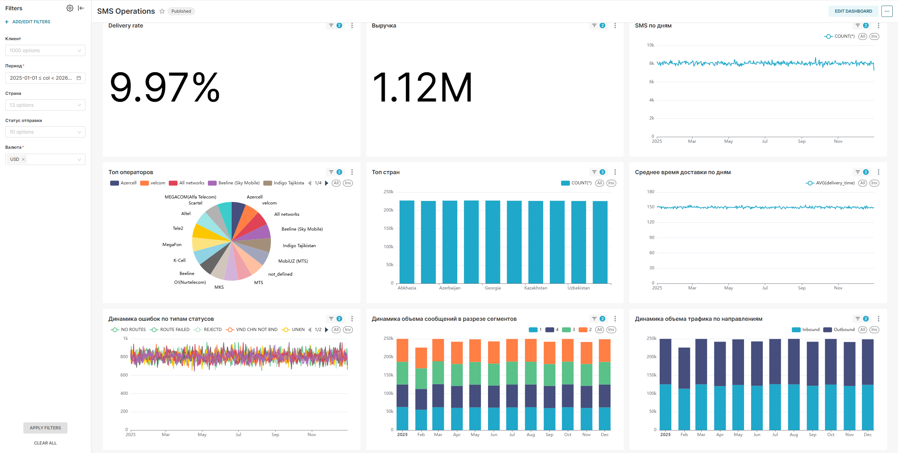
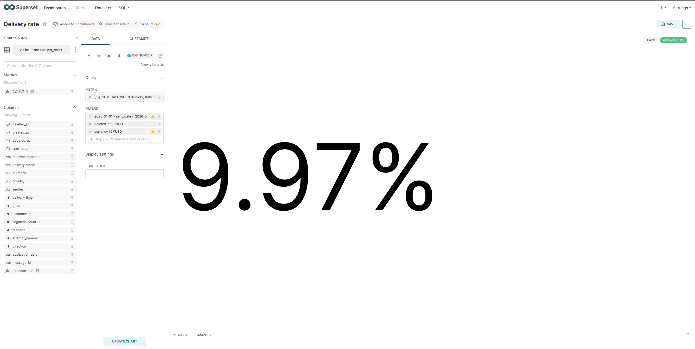
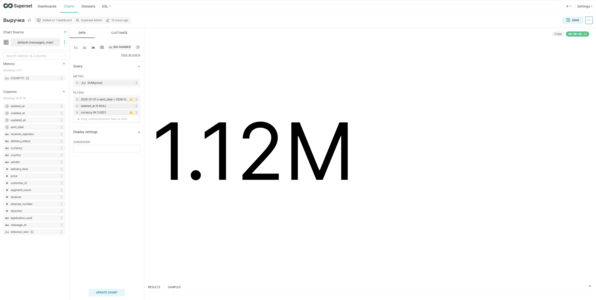
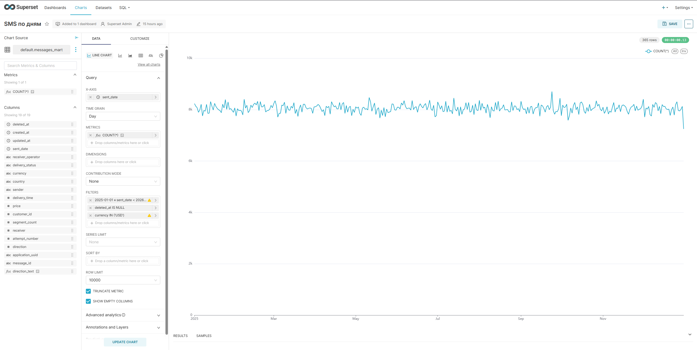
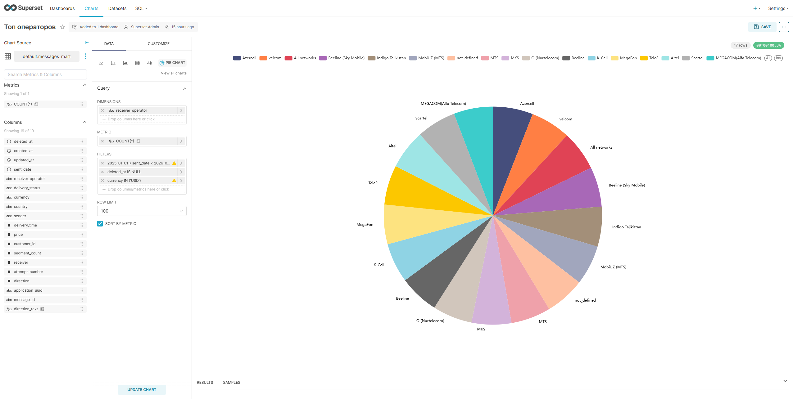
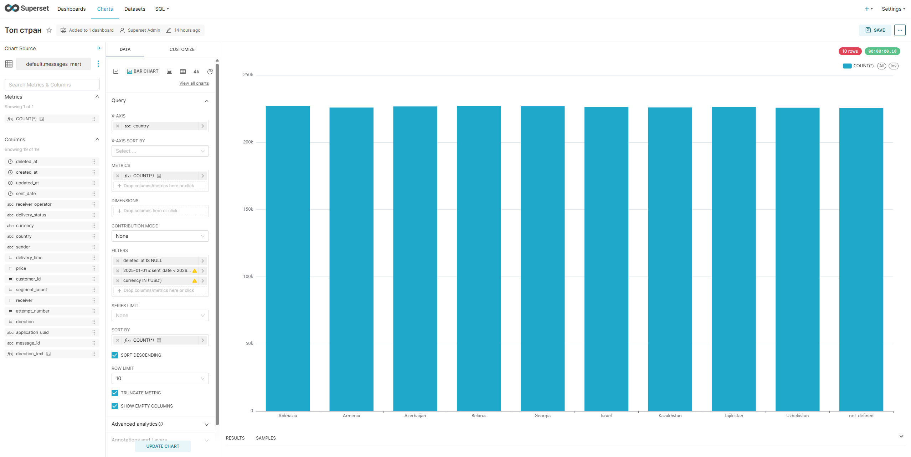
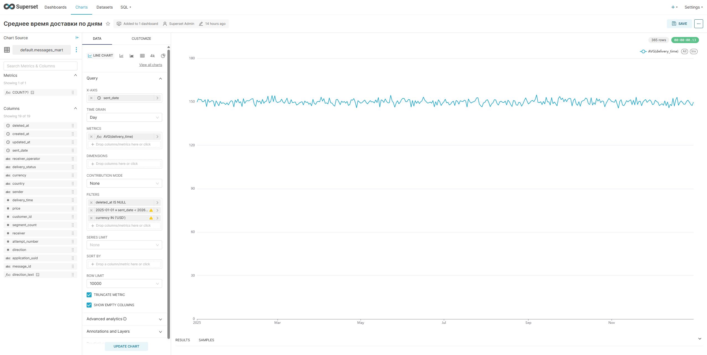
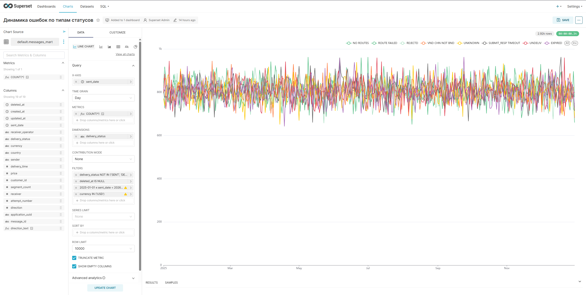
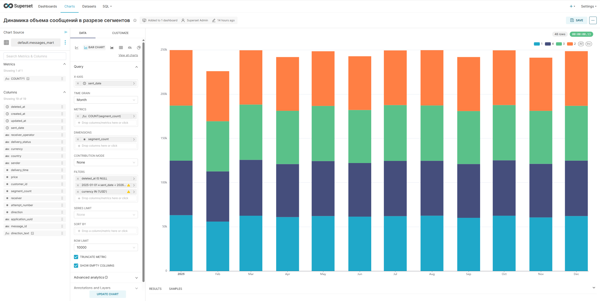
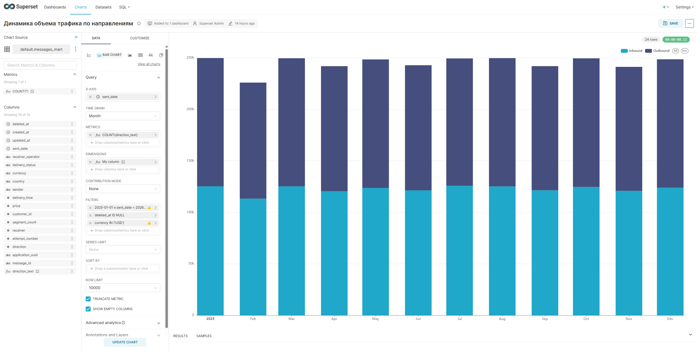

# **SMS Operations Analytics Infrastructure**

Данный проект представляет собой воспроизводимый аналитический стек (Lakehouse/Data Mart слой) для мониторинга и анализа бизнес- и системных метрик SMS-платформы.  
Инфраструктура включает в себя распределенный кластер ClickHouse, Apache Superset с преднастроенными дашбордами и автоматический генератор синтетических данных (1 000 000+ строк).

## ---

**🛠 Технологический стек**

* **СУБД:** ClickHouse (кластерная конфигурация)  
* **BI Слой:** Apache Superset  
* **Оркестрация и контейнеризация:** Docker, Docker Compose, Makefile  
* **Генерация данных:** Python (стриминг данных в CH)

## ---

**Запуск**

### **Требования (Prerequisites)**

Перед запуском убедитесь, что у вас установлены docker (с плагином compose).  
Проект спроектирован так, чтобы запуститься «из коробки» без ручной настройки баз данных или BI.

#### **Шаг 1: Запуск инфраструктуры**

Разверните распределенный кластер и BI-инструмент. Команда поднимет все ноды ClickHouse, ZooKeeper и контейнер Superset:
```bash
docker compose -f docker-compose-cluster.yml up -d
```
Убедитесь, что все контейнеры перешли в статус Up (healthy).

#### **Шаг 2: Генерация и заливка тестовых данных**
Запустите Python-скрипт, который создаст необходимую схему таблиц (локальные таблицы на каждом шарде и одну глобальную Distributed таблицу) и загрузит 1 000 000 записей:
```bash
python data_generator.py
```
Скрипт выведет логи о создании таблиц и прогресс батчевой загрузки строк.

#### **Шаг 3: Импорт готового дашборда в Superset**
- Откройте браузер и перейдите в веб-интерфейс Superset: http://localhost:8088
- Авторизуйтесь под стандартными учетными данными администратора:
- Логин: admin
- Пароль: admin
- В правом верхнем углу нажмите на иконку настроек (шестеренка) или выберите Settings ➡️ Import Dashboards.
- Нажмите Upload и выберите архив dashboard_export.zip из папки superset этого проекта.

#### **Шаг 4: Восстановление подключения к ClickHouse**
Важно: В целях безопасности Apache Superset затирает реальные пароли баз данных при экспорте конфигураций. Чтобы графики ожили, нужно обновить пароль подключения вручную.

- В верхнем навигационном меню Superset перейдите в раздел Data ➡️ Databases.
- В списке баз найдите подключение к ClickHouse (ch-node1) и нажмите на иконку Редактировать (карандаш) в правой части строки.
- В открывшемся окне найдите поле Password (или строку SQLAlchemy URI), очистите его и введите актуальный пароль:
```Plaintext
secret_password
```
- Прокрутите форму вниз, нажмите кнопку Test Connection (должна появиться зеленая плашка «Connection looks good!»), а затем нажмите кнопку Save для сохранения изменений.

## ---

**🔗 Ссылки для доступа и логины**

После успешного запуска сервисы доступны по следующим адресам:

| Сервис | URL | Логин | Пароль   |
| :---- | :---- | :---- | :---- |
| **Apache Superset** | [http://localhost:8088](http://localhost:8088) | admin | admin |

## ---

## Дашборд SMS Operations



### Настройки отдельных чартов (Edit Mode)

<details>
  <summary>Развернуть скриншоты настроек чартов</summary>

  #### 1. Delivery rate
  

  #### 2. Выручка
  

  #### 3. SMS по дням
  

  #### 4. Топ операторов
  

  #### 5. Топ стран
  

  #### 6. Среднее время доставки по дням
  

  #### 7. Динамика ошибок по типам статусов
  

  #### 8. Динамика объема сообщений в разрезе сегментов
  

  #### 9. Динамика объема трафика по направлениям
  
</details>